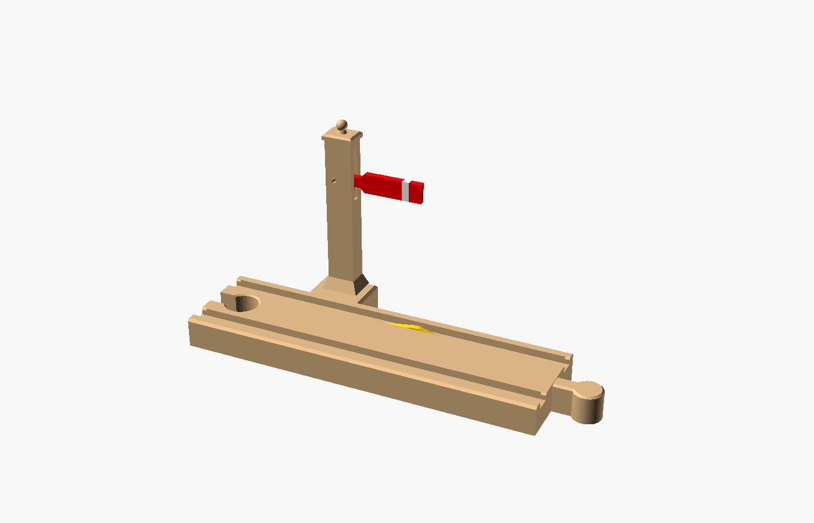
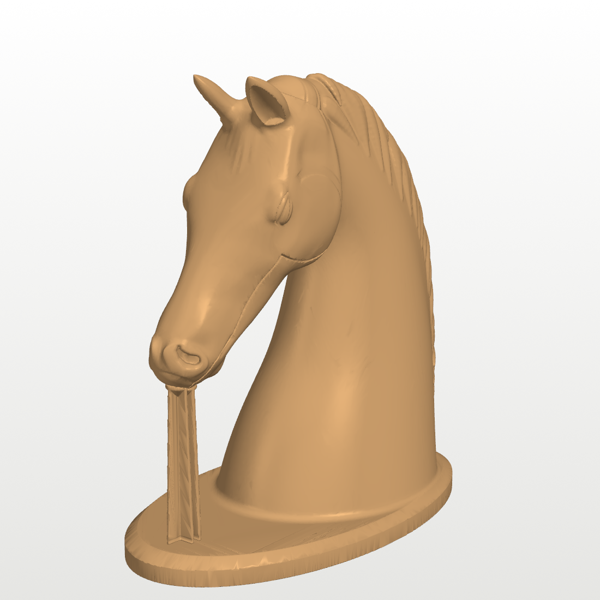
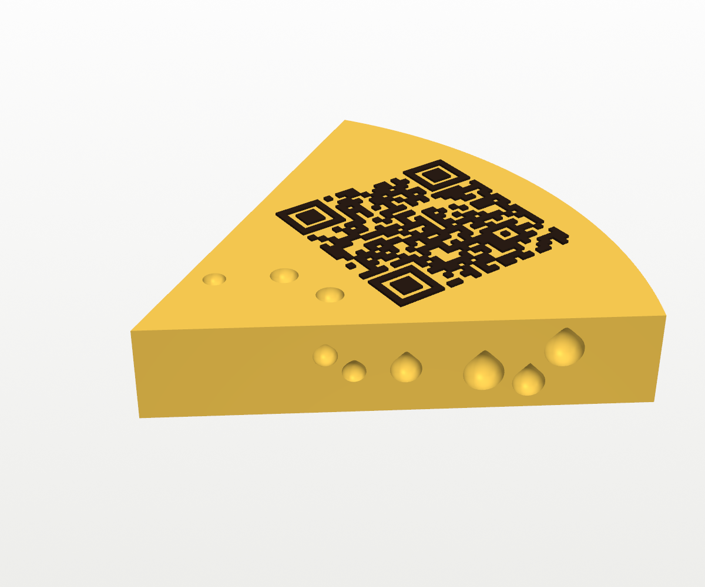
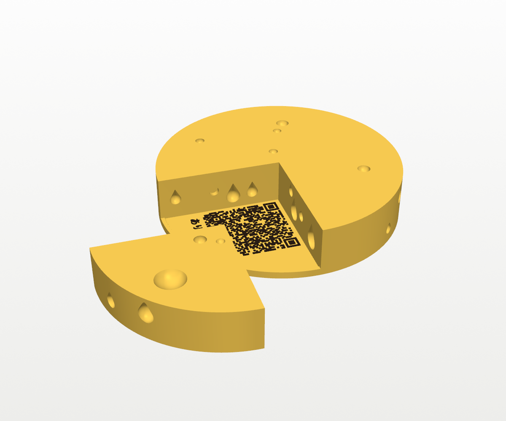

# 3D Models

This is where I experiment with AI-generated 3D models that I print at home.
I describe an idea, an AI coding assistant designs it, and I print it. Each
model is built in code (OpenSCAD or Python), so it can be tweaked and
regenerated rather than edited by hand.

Everything here is designed for a **Bambu Lab A1** printing **PLA**, with a
0.4 mm nozzle. Each model's own README has its print settings, a parts list
where needed, and assembly notes.

## Models

| | Model | What it is |
|---|---|---|
|  | [Train-tripped semaphore signal](brio-train-tripped-semaphore-signal/) | A straight piece of Brio-compatible wooden-railway track with a signal that the train works by itself. A passing wheel presses a hidden treadle and the arm swings to *clear*. No batteries, springs or glue. |
|  | [Battery box-cab locomotive](brio-battery-box-cab-locomotive/) | A small electric engine that drives itself on Brio-style track, with a big on/off button on the roof. It uses off-the-shelf parts (motor, batteries, switch, magnets, O-rings), and the README has the full parts list and links. |
|  | [Horse head with a secret compartment](horse-head-secret-compartment/) | A realistic desk-size horse bust whose lower jaw swings open to reveal a hidden compartment. It prints in one piece with no assembly: the hinge, a click detent and a snap-off support post are built in, and the Bambu Studio project has the settings ready. |
|  | [QR cheese wedge](qr-cheese-wedge/) | A Swiss-cheese wedge with a scannable QR code on top, for handing over a digital gift card in person. Two colours with one filament change, holes that need no support, and ありがとう on the side. The build script takes your link, and the real build stays out of the repo. |
|  | [QR cheese wheel](qr-cheese-wheel/) | The bigger version: a whole wheel with one quarter wedge cut, sized to the link (116 mm across for a short link). Slide the wedge out to find the QR code and ありがとう on a tile underneath. Magnets sealed inside the print hold the wedge in: the printer pauses so you can drop them in. Only the tile carries the link, so the wheel and wedge are reusable for the next gift. |

## What's in each folder

Each model folder follows the same layout:

- `README.md` covers what the model is, how to print it, and any parts or
  assembly it needs.
- `stl/` holds the ready-to-print files. Open these in Bambu Studio.
- Some models also have a Bambu Studio project (`.3mf`) with the A1 print
  settings already chosen. Open that instead of the STL when there is one.
- `images/` holds the renders used in the README.
- The source (`.scad` or `.py`) regenerates the STLs, and its key dimensions
  are parameters at the top of the file.

## Regenerating a model

- **OpenSCAD models** (the signal and the locomotive): open the `.scad` file in
  [OpenSCAD](https://openscad.org) and export an STL, or run it from the
  command line.
- **Python models** (the horse head, the cheese wedge and the cheese wheel):
  install the packages listed in that model's README and run its build
  script.

## A note on AI-generated designs

These are experiments. Each design was checked in software for fit and
printability before being committed: clearances, overhangs and watertight
meshes. Even so, the first print of any model is the real test, so treat
new designs as prototypes.
