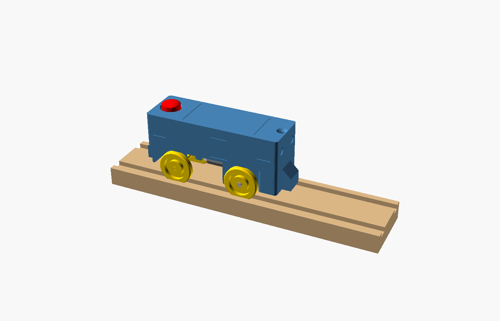
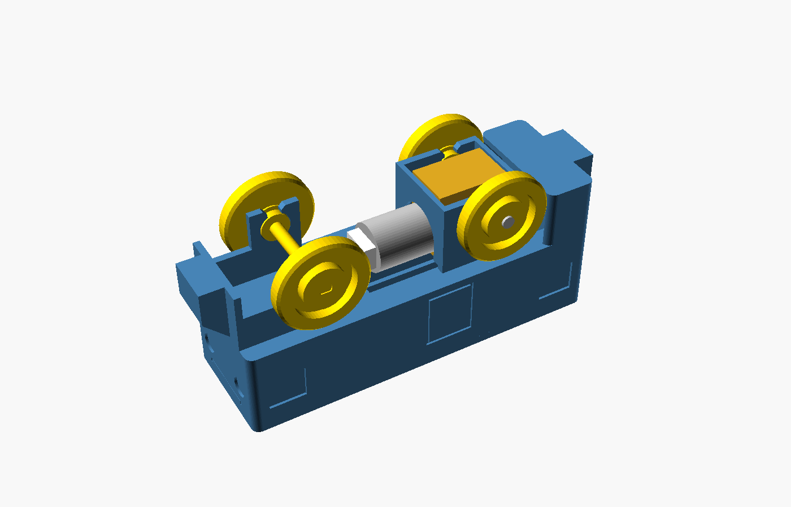
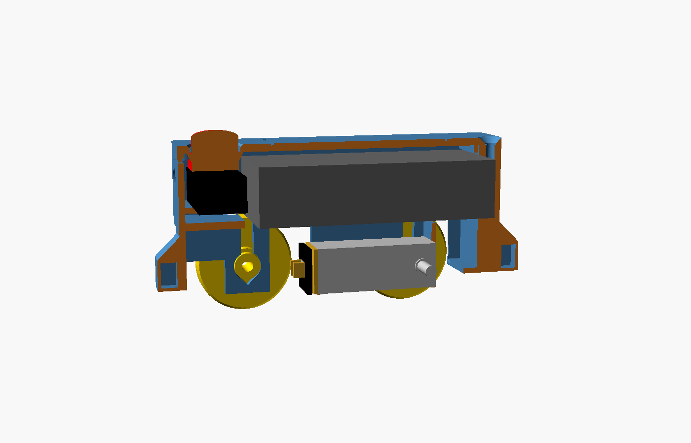

# Battery Box-Cab Locomotive (Brio-compatible) — v2

A small electric engine that drives itself on any Brio-style wooden track. A
toddler presses the big red button on the roof and it goes; pressing it again
stops it.

- **No soldering, no gears to print, one screw.** The motor's double-ended
  output shaft *is* the drive axle. All the electrical parts plug into each other.
- **Toddler-minded:** batteries under a screwed-down roof hatch; coupler magnets
  sealed inside the plastic; captive roof button; nothing reachable but the wheels.
- **Brio proportions:** 99 × 30 × 58 mm (L × W × H on the track), 45 mm
  wheelbase with the axles near the ends, so the couplers stay close to the
  track centreline on curves. Narrower than the 40 mm track, so it clears
  platforms, signals and tunnels.

| | |
|---|---|
|  |  |


*Cut-away: click switch under the roof button at the front, 2×AAA holder in the
middle, worm-gear motor under it with the can pointing forward and the shaft
driving the rear wheels. Cables coil in the bunker behind the drive wheels.*

## Bill of materials

| Qty | Part | Where | Notes |
|---|---|---|---|
| 1 | **N20 Dual Shaft Worm Gear Motor, 3 V 130 rpm (LA009)** | [Bambu Lab store](https://us.store.bambulab.com/products/n20-dual-shaft-worm-gear-motor) | The shaft is the drive axle. Rated 2–4 V, so it suits 2×AAA. |
| 1 | **50 mm PH2.0 to SH1.0 Conversion Wire (XC004)** | [Bambu Lab store](https://us.store.bambulab.com/products/50mm-ph2-0-to-sh1-0-conversion-wire) | Joins the JST-PH switch cable to the motor's SH1.0 socket. |
| 1 | **2 × AAA Battery Holder with On/Off Switch & JST PH (#4191)** | [Adafruit](https://www.adafruit.com/product/4191) | 62.5 × 25.3 × 15.4 mm. The smallest pack that runs the motor well. Its own switch stays ON inside. |
| 1 | **JST 2-pin Extension Cable with On/Off Switch (#3064)** | [Adafruit](https://www.adafruit.com/products/3064) | Push-on/push-off click switch, worked by the roof button. |
| 4 | **D6 × 2 mm round magnets** (2 per coupler) | [Bambu Lab store – magnets](https://us.store.bambulab.com/collections/magnets) | Sealed inside the couplers during printing. |
| 1 | M3 × 10 mm screw (countersunk or button head) | Any hardware store / Bambu Maker's Supply | Holds the roof hatch closed. It self-taps into the plastic. |
| 2 | AAA batteries | — | Alkaline (fastest, ~1.5–2 h running) or NiMH (a little slower). |
| — | PLA filament, ~40 g | Bambu Lab | Body, hatch, wheels, button. Three colours look great. |
| — | *Optional:* TPU 95A HF filament, ~1 g | Bambu Lab | Two traction tyres for the drive wheels (see below). |

### Why these parts

- **Battery:** 2×AAA is the smallest common pack that gives the motor its rated
  3 V with real run time. Coin cells are too weak and dangerous around toddlers.
  A LiPo would need a charger board and is a puncture risk in a toy.
- **One-direction motor:** the motor runs one way only. Which way the loco
  travels depends on how the plugs happen to line up; there's no reverse. A
  box-cab looks right running either way, so kids just turn it around by hand,
  like a Brio battery engine.
- **Pushing it by hand:** the worm gear self-locks, so with the power off the
  driving wheels slide instead of turning. Nothing can be damaged.
- **Traction:** bare PLA wheels on wood give roughly 20 g of pull, enough for a
  few wagons on the flat but marginal on Brio ramps. The optional TPU tyres more
  than double that. Brio's own engines use rubber tyres for the same reason.

## Printed parts (`stl/`)

| File | Qty | Orientation | Notes |
|---|---|---|---|
| `body.stl` | 1 | As exported (upside down) | **Pause for magnets** (below) |
| `hatch.stl` | 1 | As exported (upside down) | |
| `button.stl` | 1 | As exported | Red looks great |
| `wheel.stl` | 4 (or 2) | As exported | Plain wheel |
| `wheel_drive.stl` | 0 or 2 | As exported | Drive wheel with a tyre groove — use instead of two plain wheels if you print tyres |
| `tyre.stl` | 0 or 2 | As exported | **TPU**, fits `wheel_drive` |
| `axle.stl` | 1 | As exported (on its flat) | Front axle |
| `shim.stl` | 0–2 | As exported | Only if the button doesn't click (see below) |

Print settings for the Bambu Lab A1, PLA, 0.4 mm nozzle:

- **Layer height:** 0.2 mm. **Walls:** 3. **Infill:** 20 %.
- **Supports:** none. The body and hatch print upside down so every floor,
  shelf and fence is a short bridge between walls.
- **Wheels, axle and button:** 100 % infill. They're tiny, and stiff wheels
  press on more securely.
- A brim on the body helps, because it stands on the thin rim of its walls.
- **Tyres (TPU 95A HF):** print from the external spool holder (not the AMS
  Lite), slow (30–40 mm/s), 100 % infill.

### Estimated print time (A1)

From slicing these STLs with an A1-like profile (Bambu PLA Basic speeds and
accelerations, settings as above). Add the A1's ~5–6 min start routine per plate.

| Plate | Time | Filament |
|---|---|---|
| Body (20 % infill, brim) | ~46 min | 23 g |
| Hatch | ~11 min | 6 g |
| Button + 4 wheels + axle (100 % infill) | ~21 min | 8 g |
| 2 TPU tyres (optional) | ~3 min | 1 g |
| **Total** | **~1 h 20 min** (~1.5 h with start-up and the magnet pause) | **~38 g** |

### Sealing the coupler magnets (body print)

1. In Bambu Studio, slice `body.stl`. In the layer slider, find the first layer
   **above 33.55 mm** (33.6 mm at 0.2 mm layers). Right-click it and choose
   **Add Pause**.
2. Before printing, work out the magnet polarity so the loco couples to your
   existing Brio wagons. Make two stacks of two D6×2 magnets.
   - Let one stack jump onto the **front** coupler of a Brio wagon. Mark the face
     that is *touching the wagon*. That stack goes in the loco's **rear** pocket
     (the end with the screw), marked face **outward**.
   - Let the other stack jump onto the **rear** coupler of a wagon. Mark the
     touching face. That stack goes in the loco's **front** pocket (the end with
     the red button), marked face **outward**.
3. When the printer pauses, drop each stack into its slot, standing on edge, with
   the marked face toward the end of the loco. Resume; the printer seals the
   magnets in.

## Before you print the body: measure your motor

Bambu doesn't publish a dimensioned drawing of the LA009, so the body is
modelled around typical N20 worm-gear dimensions. The gearbox cage and the can
clearance are built from the `m_*` values at the top of
`box_cab_locomotive.scad`. Measure your motor and check:

| Value | Assumed | What it sets |
|---|---|---|
| `m_gb_x0` / `m_gb_x1` | −6 / +12 mm from the shaft, along the can direction | Gearbox cage bars (0.5 mm clearance each end) |
| `m_gb_w` | 12 mm | Must be under 17 mm to fit between the bearing walls |
| `m_gb_z0` / `m_gb_z1` | −5 / +13 mm from the shaft | Ground clearance (≥ 3 mm) and battery clearance |
| `m_can_d`, `m_can_off` | 12 mm can, axis 7 mm above the shaft | Arch in the front cage bar; can must clear the battery floor |
| `m_shaft_tip` | 15.5 mm from the motor centre, each side | Each shaft end must reach **at least 14 mm** from the centre, or the wheel hubs get too little shaft. If the shaft is longer than 15 mm it just sits deeper in the wheel's recessed face. |

If anything differs, change the value and re-export `body.stl`:

```sh
openscad -o stl/body.stl -D 'part="body"' box_cab_locomotive.scad
```

The click switch (#3064) housing is assumed to be about 12 × 24 × 9 mm. If
yours is shorter, the printed shims go under it; if it's longer than 14 mm in
one direction, lay it across the cab (the cab is 26 mm wide).

## Assembly (about 10 minutes, a screwdriver is the only tool)

1. **Tyres (optional):** stretch a TPU tyre into the groove of each
   `wheel_drive` wheel.
2. **Motor:** turn the body upside down. Hold the motor with the shaft across
   the body and the can pointing toward the **front** (button end). Lower the
   gearbox straight into the cage between the two cross bars; the can passes
   through the arch in the front bar and lies under the battery floor. Guide the
   shaft ends into the two narrow slots until they seat in the round bearings.
3. **Drive wheels:** press a wheel onto each end of the motor shaft (the
   grooved ones if you printed tyres), matching the flat in the bore to the flat
   on the shaft. Squeeze both wheels on together between your thumbs so the
   shaft is in compression and nothing is pushed through the gearbox. Stop when
   each wheel's spacer ring is **a hair (≈0.3 mm, a sheet of paper) from the
   frame**: the wheels must spin without rubbing. The 7 mm hubs now fill the
   bearings and can never drop back out through the 3.4 mm slots, which is what
   holds the motor in.
4. **Front wheels:** push the printed axle up into the front slots, then press a
   plain wheel onto each end the same way, again leaving a paper-thin gap.
5. **Wiring:** turn the body right side up. Plug battery holder → click-switch
   cable → Bambu conversion wire → motor. Every plug only fits one way. Lay the
   click switch on the shelf in the front cab, button facing up. Feed the
   conversion wire and motor lead down through the floor opening at the front of
   the battery bay to the motor plug. Coil the spare switch cable into the
   bunker at the back of the battery bay and in the gaps beside the motor.
6. **Batteries:** put 2×AAA in the holder and slide its own switch to **ON**.
   Lay it in the battery bay with its lead toward the **front** (it hops over the
   low fence onto the switch shelf). If the lead comes out of the other end, run
   it along the top of the holder; there is 2.5 mm under the roof for it.
7. **Roof:** drop the red button into the hatch from underneath (its flange
   keeps it captive). Hold the hatch tilted, push its front tongue through the
   slot in the front wall, lower the back, and fit the M3 screw at the rear.
8. **Test:** press the button. The motor should start; press again to stop. If
   the button bottoms out without a click, the switch sits lower than expected:
   put one or two `shim.stl` pads under it.

## Speed

There is no speed control; the motor's gear ratio sets it. With 22 mm wheels:

| Power | Motor speed | Loco speed (no load) | Pulling 2–3 wagons |
|---|---|---|---|
| 2 × alkaline AAA (≈3.1 V) | ~135 rpm | ~15 cm/s | ~11–13 cm/s |
| 2 × NiMH AAA (≈2.4 V) | ~105 rpm | ~12 cm/s | ~9–10 cm/s |

For comparison, Brio's standard battery engine runs at roughly 8–10 cm/s
(measured by eye on a loop; Brio doesn't publish it). So on alkalines this loco
is a little brisker than Brio's; on NiMH it matches. 15 cm/s is one standard
straight per second.

**Derailing:** speed isn't the risk. On the tightest Brio curve (R ≈ 182 mm)
15 cm/s gives a sideways push of about 1 % of the loco's weight; it would need
to go ~40× faster to tip. What derails wooden trains is a wagon catching on a
switch or a lumpy joint, and a lighter, slower train helps there too.

**Ways to slow it down, in order of ease:**

1. Use **NiMH rechargeables** — 20 % slower, no changes. Also the safer cell
   type for a toddler toy.
2. Set `wheel_d = 20` in the model and re-export the wheels (and body, because
   the axle height follows the wheel). ~10 % slower. Don't go below 20 mm: the
   gearbox would get too close to the track.
3. A speed knob: Bambu's Potentiometer Board plugs into their Power
   Distribution Board (IA005), but the PDB is 53 mm long and would need a longer
   body. Not worth it for a toddler's engine.

## Brio compatibility

- **Wheels:** 22 mm diameter at 26 mm gauge, 4 mm wide, running in the standard
  6 × 3 mm grooves.
- **Curves:** 45 mm wheelbase with 24 mm front / 30 mm rear overhang. On a
  standard Brio curve (R ≈ 182 mm) the couplers sit about 4.5 and 6 mm off the
  track centreline, similar to Brio's own engines, so magnets stay coupled.
- **Couplers:** magnetic, centre 10 mm above the track surface.
- **Clearance:** lowest point 2.9 mm above the track surface (the bearing
  walls). Clears switches, crossings and ramp transitions.

## Safety notes

This is a home-made toy, not a certified one. Before handing it to a toddler:

- **Wheels:** check that all four wheels are pressed on hard and can't be pulled
  off. A loose 22 mm wheel is a small part; add a drop of superglue to each wheel
  bore if in doubt.
- **Hatch:** keep the hatch screw tight. Batteries must not be reachable without
  a screwdriver.
- **Magnets:** make sure no magnet is visible after printing. Swallowed magnets
  are dangerous.
- **Shaft ends:** if the motor shaft protrudes beyond the wheel face, file it
  flush or fill the wheel recess with a dab of glue.
- **Supervision:** supervise play, and remove the batteries if the toy is stored
  for a long time.

## Customising

Open `box_cab_locomotive.scad` in OpenSCAD and set `part = "assembly"` to
preview everything, `"cutaway"` for the section view. Useful parameters:

- `m_*` – your motor's dimensions (see above).
- `batt_xc` – battery position; more negative moves weight off the drive axle.
- `wheelbase` – 45 mm default.
- `mag_z` – coupler height. `bore_d` / `bore_flat` – wheel press fit.
- `groove_dp`, `tyre_t` – tyre groove depth and tyre thickness.

## Changes in v2

- Motor turned round (can forward under the battery) and the axles moved to
  the ends: rear overhang cut from 52 mm to 30 mm, total length 107 → 99 mm.
  On a Brio curve the rear coupler is now ~6 mm off centre instead of ~12 mm.
- Gearbox cage so the motor body can't rock under load.
- Switch shelf fence and battery stops rebuilt as wall-to-wall bridges; the old
  ones started in mid-air when printed upside down.
- Hatch tongue now passes right through the front wall (was 0.4 mm engagement).
- Optional TPU traction tyres; deeper wheel recess hides a long shaft end.
- Button foot no wider than the stem; cable slot under the switch shelf; 2.5 mm
  cable room above the battery; corrected run time and shaft-length guidance.
