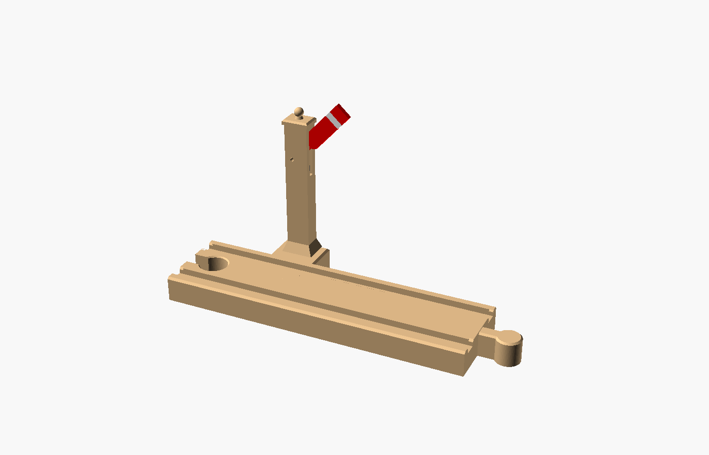
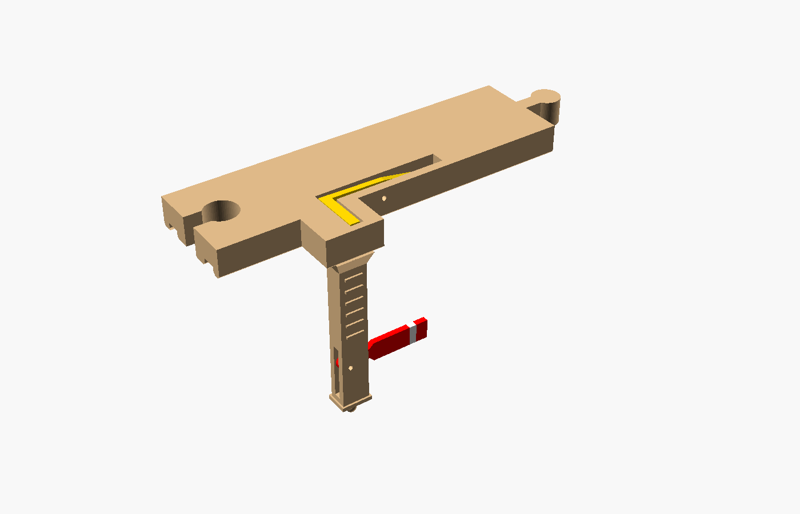

# Train-Tripped Semaphore Signal (Brio-compatible)

A 144 mm straight track for Brio-style wooden railways with a semaphore signal
that **the train works by itself**. Most printable signals are decorative or
have to be flipped by hand. This one has a hidden see-saw treadle in one groove:
a passing wheel presses it, a push-rod rises inside the post, and the blade
swings from *danger* (horizontal) to *clear* (~47°). Once the train has passed,
gravity drops everything back. It uses no batteries, springs, magnets or glue.

| At rest | Train passing (treadle pressed) |
|---|---|
|  |  |



## How it works

```
   blade ──●  pivot pin                 wheel
           │ ▲ rod pushes blade up        ▼
           │ │                     ┌──────────┐  groove floor
           │ │ push-rod            │  treadle │ (rises 2.4 mm above floor)
  ═════════╧═╧════════ pivot ●═════╧══════════╧═══
         see-saw arm  ◄── 20 mm ──►◄── treadle ──►
```

* The treadle stands 2.4 mm proud of the groove floor and has gentle ramps at
  both ends, so trains can run over it in either direction.
* A wheel pushes it flush with the floor (a 9.6° see-saw rotation). Then the
  arm on the far side of the pivot lifts the push-rod 3.3 mm.
* The rod pushes the blade 4.7 mm from its pivot, which raises the blade about 47°.
  The post cap stops the blade at about 50° if a child lifts it by hand.
* It needs only about 4–9 g on a wheel to trip, so wooden carriages work too, not
  just motorised engines.
* The moving parts were checked against the base for collisions at rest and when
  pressed. When pressed, the treadle sits 0.17 mm *below* the groove floor, so
  wheels never bump.

## Files

| File | What | Print orientation |
|---|---|---|
| `stl/base.stl` | Track + signal post (male/female ends, like a standard straight) | As-is, flat on the bed |
| `stl/base_female_female.stl` | Same, with female sockets on both ends | As-is |
| `stl/seesaw.stl` | Treadle / see-saw lever | As-is (flat plate down, arm up) |
| `stl/rod.stl` | Push-rod, 3 × 3 × 55 mm | As-is (lying down) |
| `stl/blade.stl` | Semaphore blade, single colour | As-is |
| `stl/blade_red.stl` + `stl/blade_white.stl` | Blade split into two colours for AMS | As-is, loaded as one object |
| `semaphore_signal_track.scad` | Parametric OpenSCAD source | |

Plus **two short pieces of 1.75 mm filament** as axle pins.

## Printing on the Bambu Lab A1

Bambu Studio, generic PLA, 0.4 mm nozzle:

* **Layer height:** 0.16 mm (0.2 mm works; 0.16 gives smoother pin holes and peg).
* **Supports:** none. The pin holes are teardrop-shaped and the cavities only need short bridges.
* **Walls:** 3–4 loops; **infill** 15–20 % for the base.
* **Base:** a brim isn't needed, but turn one on if your bed adhesion is marginal. The post is 84 mm tall.
* **Small parts (rod, see-saw, blade):** 100 % infill or 4+ walls. They are tiny,
  so this costs almost nothing and makes them stiff.

### Multi-colour blade with the AMS Lite

1. Drag **both** `blade_red.stl` and `blade_white.stl` into Bambu Studio together.
2. When asked *"Load these files as a single object with multiple parts?"*, choose **Yes**.
3. In the object list, set the main part to red and the stripe part to white.

Suggested colour scheme: wood-colour or natural PLA for the base, **yellow** for the
see-saw (the treadle peeking out of the groove is a nice visual cue), and any colour
for the rod.

## Assembly (≈ 2 minutes)

1. **See-saw:** turn the base upside down. Drop the see-saw into the slot from
   underneath. The treadle goes up through the groove and the long arm runs out
   under the post. Push a ~14 mm length of 1.75 mm filament into the small hole
   in the side of the track, just beside the post platform. It passes through
   the see-saw's pivot hole. Trim it flush.
2. **Push-rod:** turn the base right side up. Drop the rod into the top of the
   post, through the blade slot, until it rests on the see-saw arm.
3. **Blade:** slide the blade into the slot at the top of the post, with the flat
   step on its underside sitting on the rod. Push an ~8 mm filament pin through
   the post's side hole and the blade. Trim flush on both sides.
4. Test it: press the treadle with a finger and the blade should rise. Let go
   and it should drop back.

If the blade is sluggish, ream the blade's pivot hole with a 2.3–2.5 mm drill
bit, or reprint with `pin_free = 2.5`. If a filament pin is loose in the base,
add a drop of glue, or reprint with `pin_tight = 1.8`.

## Customising

Open `semaphore_signal_track.scad` in OpenSCAD and set `part = "assembly"` to
preview everything, or `"assembly_pressed"` to see the tripped position. Useful
parameters:

* `female_female` – female sockets on both ends instead of male/female.
* `peg_d`, `sock_d` – connector fit, if your other track brands are tight or loose.
* `pin_tight`, `pin_free` – filament-pin hole sizes.
* `theta`, `arm_r`, `rod_d` – treadle travel and lever ratios. The console echoes
  the resulting rod lift and blade angle.

To export a part from the command line:

```sh
openscad -o stl/base.stl -D 'part="base"' semaphore_signal_track.scad
```

## Track standard used

Brio-style track: 40 mm wide, 12 mm tall, 6 mm × 3 mm grooves at 26 mm centres,
11.6 mm connector peg on a 6 mm neck, and a 13.2 mm socket (loose fit, like the
real thing). The signal post and platform sit 6–16 mm beside the track on one side,
so leave that side clear of parallel tracks.
