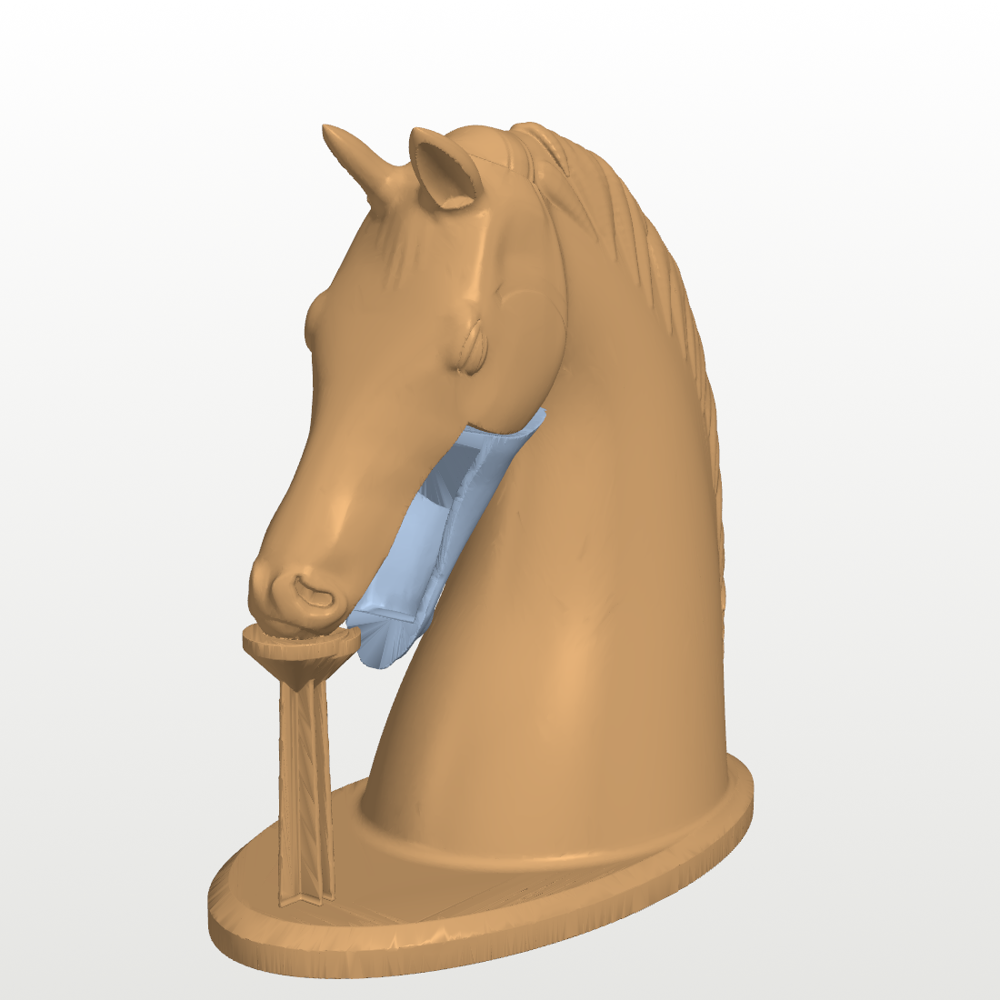
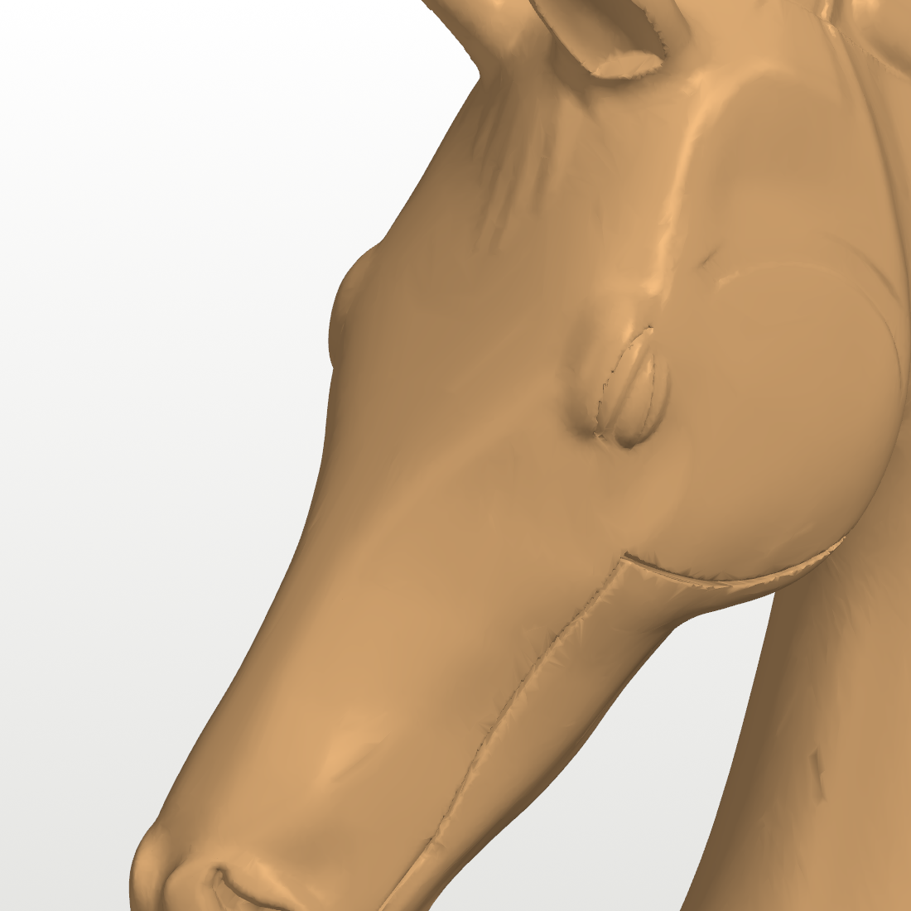
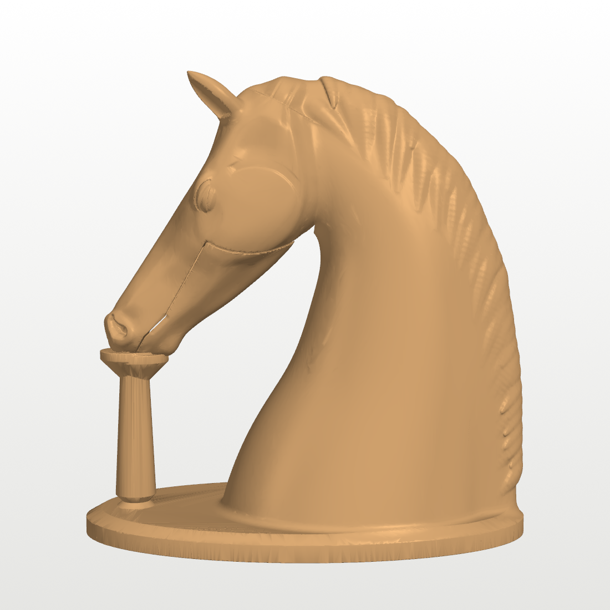
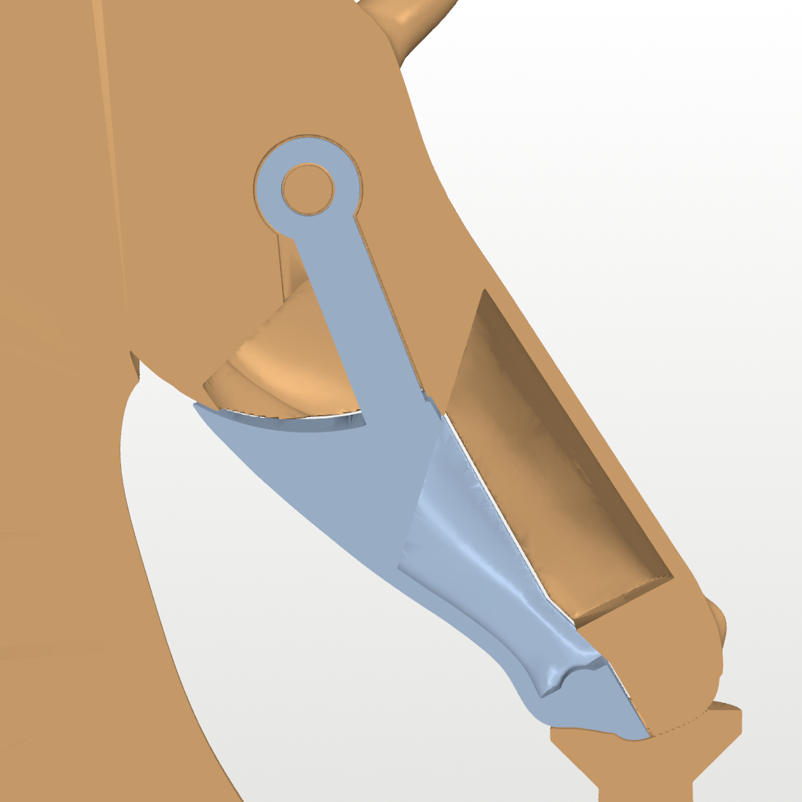

# Horse Head with a Secret Compartment

A desk-size horse bust whose lower jaw swings open to reveal a hidden
compartment. **One print, one part, no assembly:** the jaw, its hinge pin and
a click detent are all printed in place. After printing you snap off the
support pillar under the muzzle, work the jaw a few times, and it's done.

| Closed | Open |
|---|---|
|  |  |

| Face | Side |
|---|---|
|  |  |


*Section through the centre. The jaw (blue) hangs from a pin printed with the
body. The compartment is the hollow of the jaw plus a chamber above it inside
the face. The flexible tongue on the jaw's arm clicks into a dimple in the
slot wall when the mouth is shut.*

## What it is

- **Size:** __SIZE__.
- **Sculpt:** an original parametric sculpt, not a downloaded model. It has a
  realistic, calm head carried low on an arched neck, with:
  - cupped, leaf-shaped ears;
  - lidded almond eyes under a bony brow;
  - flat cheeks with a defined jowl;
  - comma-shaped nostrils;
  - separate upper and lower lips and a chin;
  - a forelock and a mane of draped locks falling to the right.
- **Compartment:** about __CAV__ cm³. The jaw is a hollow scoop with 2.2 mm
  walls, and it lines up with a chamber in the face above it. It holds a ring,
  a few coins, a USB stick, a folded note or a key. The mouth opens 20°,
  which leaves a gap of about 25 mm at the lips.
- **Hinge:** the jaw pivots where a real horse's does, just behind and below
  the eye.
  - The pin is printed as part of the head, running across an internal slot.
  - A ring on the end of the jaw's arm turns on the pin.
  - The visible seams follow the jaw line: from the corner of the mouth back
    under the cheek, then round the front of the jowl. A closed mouth looks
    like a closed mouth.
- **Detent:** the jaw's arm carries a thin flexible tongue on each face with a
  small nub. The nub clicks into a dimple when the mouth is shut, so the jaw
  doesn't fall open on its own. Pull the chin down past the click to open;
  push it up until it clicks to close.

## Files

| File | What |
|---|---|
| `stl/horse_head.stl` | **The part to print.** Body, jaw and support pillar in one file, already positioned. |
| `horse_sculpt.py` | The sculpt: a signed-distance-field model in Python. |
| `build_horse.py` | Cuts and hinges the jaw, hollows the compartment, adds the detent and the pillar, and meshes the part. |
| `verify_horse.py` | Checks: watertight, jaw swing without collisions, no mid-air islands, overhang report, compartment volume. |
| `stl/preview_*.stl` | Body, closed jaw and open jaw as separate meshes, for viewing. |
| `tools/` | Renderers and quick-draft scripts used while sculpting. |

## Printing (Bambu Lab A1, PLA, 0.4 mm nozzle)

- **Orientation:** as exported, standing on the plinth.
- **Layer height:** 0.2 mm (0.16 mm looks nicer on the face). **Walls:** 3. **Infill:** 10–15 %.
- **Supports: off.** The model brings its own. A pillar stands under the
  muzzle with a one-layer air gap under the upper lip and the chin, like a
  support interface. Everything else is self-supporting:
  - The head is tilted so the face and jaw undersides lean less than 45°.
  - The compartment's back walls are slanted.
  - The cheeks are hollowed to a pitched roof over the hinge arc.
- **Leave "detect thin walls" off** and keep the default overhang settings.
  The 0.45 mm gaps between jaw and head are meant to print as air.
- The plinth is wide enough that a brim isn't needed.
- The undersides of the cheeks overhang the throat a little steeply. They
  print fine, but are the roughest surface on the model. You can paint a
  small support enforcer there if you want them perfect.

### Estimated print time

__TIME__

## After printing

1. **Remove the pillar.** It stands on the plinth under the muzzle and is
   notched just above the plinth. Twist it off with pliers, then pick off the
   two small pads under the lips. Sand or trim the contact spots.
2. **Free the jaw.** Pull the chin down firmly. The first movement breaks the
   faint bonds across the print-in-place gaps, and you'll feel the detent let
   go. Work it open and shut a dozen times until it moves smoothly.
3. The jaw should click shut and stay shut. If the click is too weak or too
   strong, change `NUB_PROUD` (default 0.75 mm) and reprint.

## Customising

```sh
pip install numpy scipy scikit-image trimesh manifold3d shapely vtk
python3 build_horse.py              # final, 0.3 mm grid (about 20 min)
python3 build_horse.py --res 0.6    # quick draft (about 3 min)
python3 verify_horse.py             # checks
python3 tools/make_images.py        # README pictures
```

- `horse_sculpt.py` holds the shape:
  - `L`, `TILT` and `POLL` set the head length, the nose-down angle and the
    position of the poll.
  - `ZT`, `ZB` and `W_ROWS` hold the head's measured profile and widths.
  - `NECK` and `CREST` define the neck. The features each have their own
    function: eyes, nostrils, ears, mane.
- `build_horse.py` holds the mechanism:
  - `OPEN_MAX` is the opening angle.
  - `GAP` and `PIN_GAP` are the print-in-place clearances.
  - `WALL` is the compartment wall.
  - `NUB_PROUD` sets the detent strength.
  - `TMJ` and `R_ARC` set the hinge position and the cheek arc.

To scale the whole thing, scale the STL in the slicer. The 0.45 mm gaps scale
too, so stay within about 85–125 %.

## How it's made

The bust is a signed distance field built from simple pieces:

- **Head:** a loft whose top line, bottom line and widths at seven heights
  were calibrated against a real horse head.
- **Face features:** sculpted shapes blended onto the loft for the brow,
  eyes, cheeks, nostrils, lips and ears.
- **Neck:** an ellipse swept along a spline.
- **Hair:** locks laid onto the surface by a little gravity simulation.

The field is meshed with marching cubes, evaluating it exactly only near the
surface.

The jaw is cut from the same field below the mouth line and in front of an
arc centred on the hinge, so it can turn without opening any visible gap. The
head is carved by the union of the jaw at every angle from shut to fully
open, plus 0.45 mm, so it cannot bind.

The checks in `verify_horse.py` show:

- both parts are watertight;
- the jaw only touches the head at the detent nubs through the whole swing,
  once the pillar is removed;
- no layer starts in mid-air.

### Reference

The head's proportions were measured from the **Cyberware horse scan**, a
public 3D-scanning test model from the Georgia Tech Large Geometric Models
Archive, obtained via
[alecjacobson/common-3d-test-models](https://github.com/alecjacobson/common-3d-test-models).
It was used as a measuring reference only: profile heights, widths and
landmark positions. No geometry from it is in this model.
