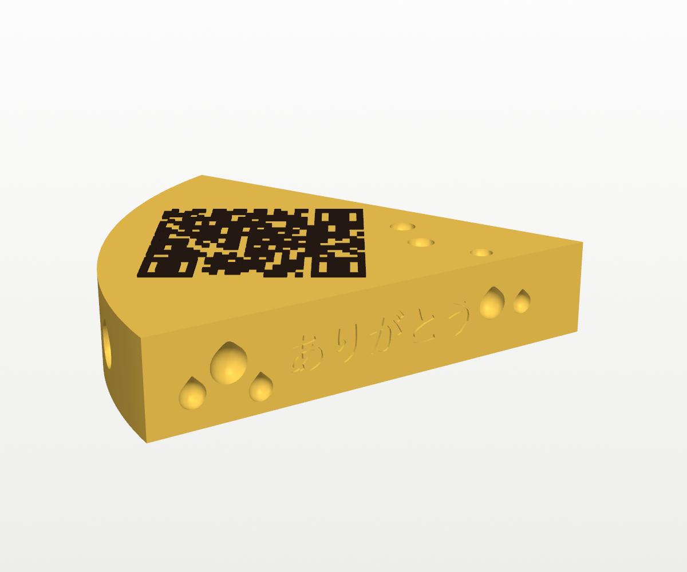

# QR Cheese Wedge

A Swiss-cheese wedge with a scannable QR code on top. It's a physical way to
give someone a digital gift card or any other link. I made it to go with a
charcuterie gift, so the QR code opens an e-gift card and the side says
ありがとう ("thank you").

| | |
|---|---|
|  |  |

*The renders and the files in `stl/` use a placeholder link
(olympiaprovisions.com). Build your own copy with your link as described below.*

## What it is

- **Size:** about 134–139 × 142–147 mm footprint, 28 mm tall, with a 64° wedge
  cut from a wheel. The QR code is 61.5 mm square, and the wedge is sized so
  the code plus its light border fits on the top face.
- **QR code:** the dark modules stand 0.8 mm proud of the top face.
  - Error correction is level M (about 15%).
  - A ~90-character link makes a 41 × 41 code with 1.5 mm modules. Shorter
    links get bigger modules, so the wedge is the same size whatever the link.
  - The build refuses links that would need modules finer than 1.2 mm.
- **Holes:** there are Swiss-cheese dents on both sides and the rind, plus
  craters on top near the point. Every side hole has a 45° pointed roof, so
  nothing needs support. No hole touches the QR area or the text.
- **Text:** ありがとう is debossed 0.7 mm into the left side. Set `THANKS = ""`
  in `build_wedge.py` to leave it off, or change the text. It needs a Japanese
  font, and the script looks for IPAGothic, Hiragino or MS Gothic.

## Making one with your own link

> **A gift-card QR code is the gift card.** Anyone who scans it can spend it.
> Don't commit the real build, and don't post photos of the top.

```
pip install qrcode manifold3d trimesh numpy matplotlib pillow
python3 build_wedge.py "https://your-link-here"            # -> private/ (git-ignored)
python3 make_3mf.py private                                 # -> private/cheese_wedge.3mf
```

`make_3mf.py` uses `private/wedge_iso.png` as the plate thumbnail. If you
haven't rendered one (`python3 render.py private private`, which needs `vtk`),
pass `images` as the second argument to borrow the placeholder thumbnail.

Run `build_wedge.py` with no link to rebuild the placeholder sample in `stl/`.

**Test the scan before you print.** `render.py` writes a top view. Point your
phone at `wedge_top.png` on screen, and check that it opens the right page.

## Files

| File | What |
|---|---|
| `build_wedge.py` | Builds the wedge from a link. Its key dimensions are parameters at the top. |
| `make_3mf.py` | Builds the Bambu Studio project with two filaments assigned. |
| `render.py` | Two-colour preview renders (VTK). |
| `bambu_profiles/` | The A1 / PLA Basic / 0.16 mm High Quality presets, with inheritance resolved. |
| `stl/cheese_body.stl`, `stl/cheese_qr.stl` | The placeholder sample as two parts that line up: the body and the QR. |
| `stl/cheese_wedge.stl` | Both parts merged, for a single-filament print with a filament swap. |
| `stl/cheese_wedge.3mf` | The placeholder sample as a Bambu Studio project. |

## Printing in Bambu Studio

The QR code sits entirely above the top face, at z = 28.0 mm. Every layer
below is cheese and every layer above is code, so the print needs exactly one
colour change.

**With an AMS (lite):** open `cheese_wedge.3mf`. Slot 1 is the cheese yellow
and slot 2 is the dark colour, so map them to your spools when you print.
The project selects these presets:

- Printer: **Bambu Lab A1 0.4 nozzle**
- Filament: **Bambu PLA Basic @BBL A1** ×2
- Process: **0.16mm High Quality @BBL A1**, modified as follows:
  - seam at the back (on the rind)
  - no brim
  - no supports
  - 12% infill

**Without an AMS:** import `cheese_wedge.stl`. Slice, drag the layer slider to
the first layer above **28.00 mm**, then right-click and choose **Add pause**
(or **Change filament**). When the printer stops, swap to the dark filament
and resume.

**Colours:** use a matte yellow for the cheese and black or dark brown for the
code. Matte filament scans more reliably than silk or shiny filament, because
glare washes out the modules.

The print takes roughly 100 g of PLA at 12% infill. The dark top layers are
only 0.8 mm, so the swap costs little filament.
