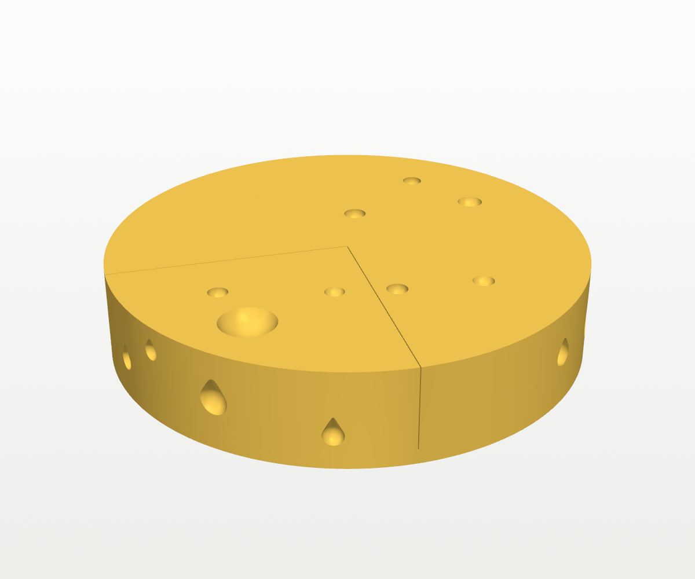
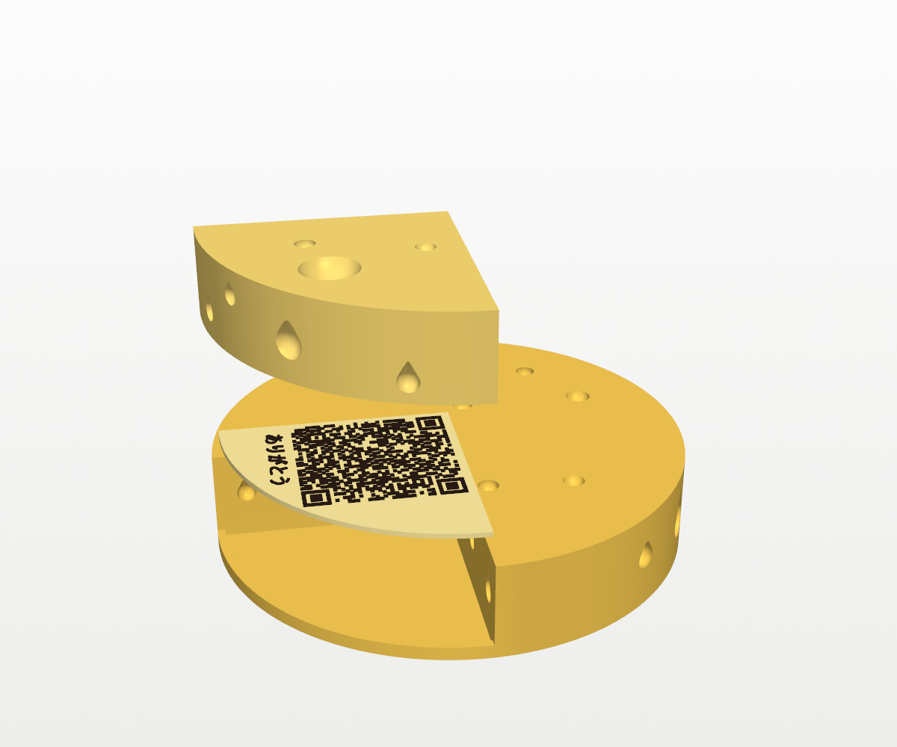
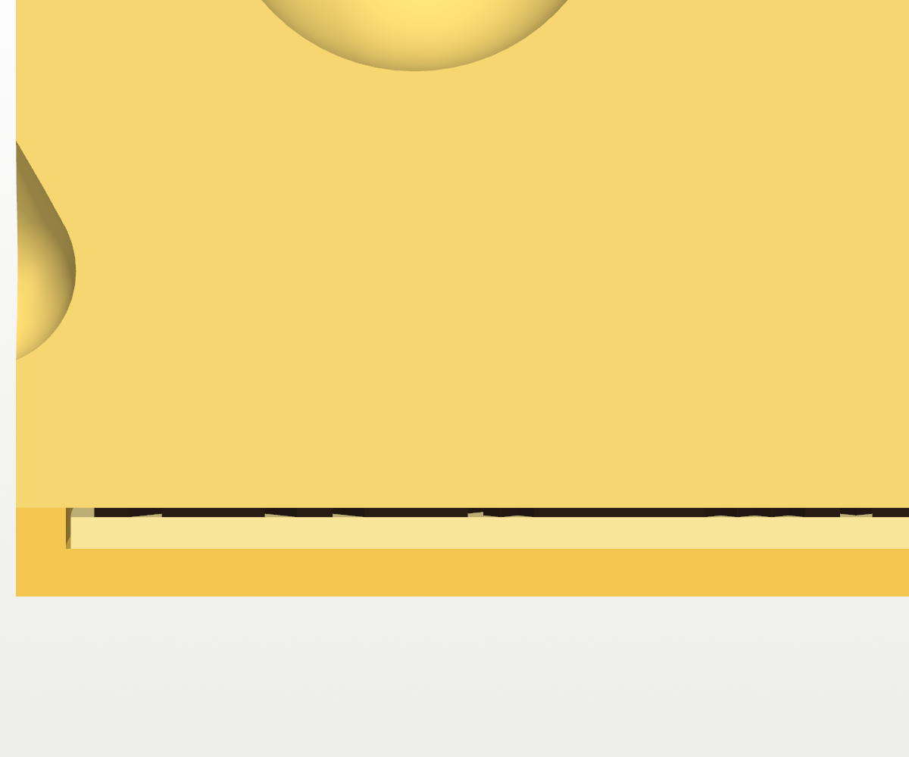
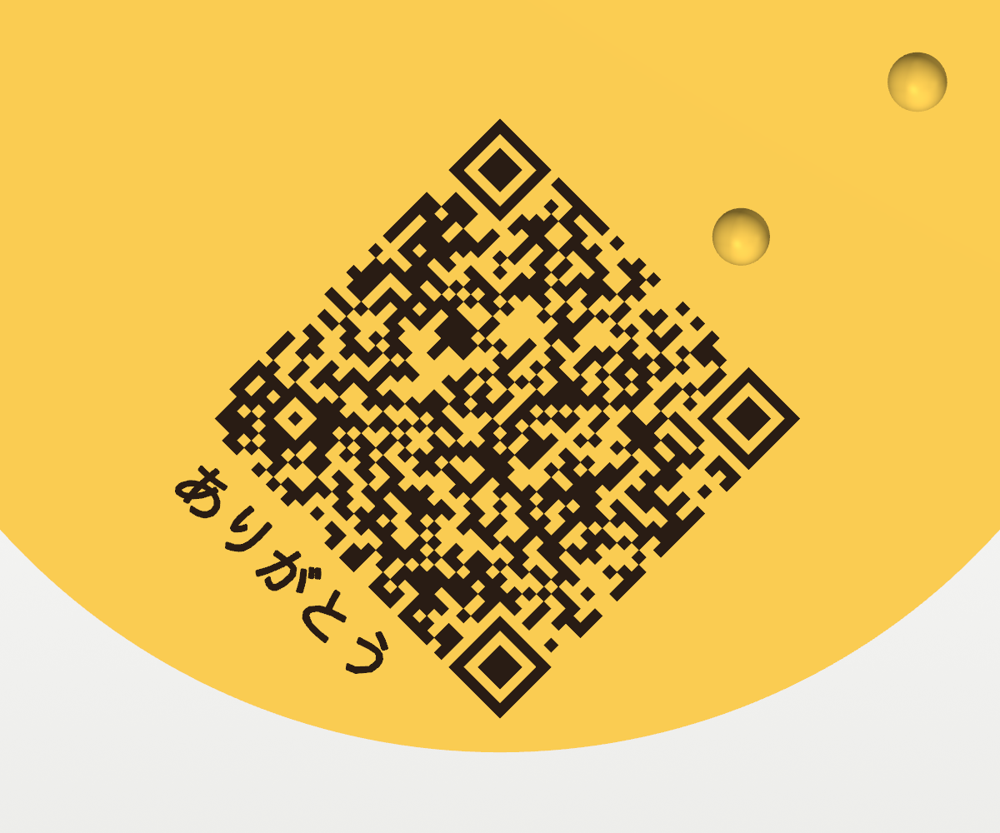

# QR Cheese Wheel

A Swiss-cheese wheel with a quarter wedge cut. Slide the wedge out and a QR
code is waiting underneath, with ありがとう ("thank you") beside it. It's a way
to hand over a digital gift card in person. This is the bigger version of the
[QR cheese wedge](../qr-cheese-wedge/).

| Closed | Open |
|---|---|
|  |  |

*The renders and the files in `stl/` use a placeholder link
(olympiaprovisions.com). Build your own as described below.*

## How it fits together



The model has three parts, from the bottom up:

1. **Wheel:** 156 mm across and 32 mm tall, with a quarter notch.
   - The notch doesn't go all the way down. It keeps a 2.4 mm floor, which is
     the wheel's own bottom carried on under the wedge.
   - At the rim, a 2.5 mm lip rises from that floor.
2. **Tile:** a 1.6 mm plate that drops into the floor of the notch, inside the
   lip.
   - The QR code and ありがとう stand 0.48 mm proud on top in the dark colour.
   - The walls and the lip hold the tile in place, so it stays put when the
     wedge slides out.
3. **Wedge:** the missing quarter of the wheel, sitting on the code and the
   lip.
   - It's flush with the wheel's top and rind, with 0.3 mm clearance at the
     walls.
   - The notch walls are at right angles and open at the rim, so the wedge
     comes free as soon as you slide it outward. The finger dimple on top is
     for that pull.
   - **Magnets hold it in.** Behind each notch wall, two 6 × 2 mm disc
     magnets are sealed inside the wheel, standing on edge in slots. Two more
     sit in each of the wedge's sides, facing them, making four pairs in all.
     - The magnets go in during printing: the printer pauses at the layer that
       closes the slots, you drop them in, and it prints over them. There's
       no glue, and nothing shows.
     - A 0.6 mm skin of plastic covers each magnet, so the faces of a pair end
       up about 1.75 mm apart.
     - The wedge snaps home and stays put when the wheel is tilted or
       carried, and a finger in the dimple still slides it out.
     - Without magnets, only gravity holds the wedge, and it slides out as
       soon as the wheel tips.
     - Set `MAGNET_MODE = "glued"` in `build_wheel.py` for open pockets you
       glue magnets into after printing.


*A cut through the middle of the wedge at the rim. From the top: the wedge
(pale), the dark code, the tile (paler), and the wheel's floor (yellow), with
the lip at the left. When the wedge is in, the only visible joins are the two
vertical seams on the rind and the lines on top. There is also a fine
horizontal line 4.8 mm up the wedge's rind, where it sits on the lip.*

When the wedge is out, the tile is the floor of the notch, so you look down
into the cut and the code is at the bottom of it:



Bubbles on the notch walls are shared, leaving half a dent in the wheel and
half in the wedge, so they line up when the wedge is in. Every side hole has a
45° pointed roof, so nothing needs supports.

## Why it's this size

The wheel is as small as a reliably scannable code allows. Every dimension
follows from the code.

**Module size.** `scan_test.py` simulates a phone scanning the printed tile.
- It models these conditions:
  - print spread and wobble
  - the dark side walls of the raised modules seen at an angle
  - camera tilt up to 35°, at 3–7 pixels per mm (a phone 20–45 cm away)
  - blur, noise and JPEG compression
  - the notch wall's shadow falling across the code
- It counts how many single camera frames two independent decoders read. With
  this 41 × 41 gift-card code, 200 trials per size:

  | Module | Code | Frames decoded |
  |---|---|---|
  | 1.0 mm | 41 mm | 74% |
  | 1.1 mm | 45 mm | 88% |
  | **1.2 mm** | **49 mm** | **94%** |
  | 1.3 mm | 53 mm | 96% |
  | 1.5 mm | 62 mm | 99% |

- 1.2 mm is the knee. Smaller sizes fall off fast, while bigger ones add
  wheel for a few percent. A phone tries dozens of frames a second, so 94% per
  frame reads almost instantly.

**Relief height.** Raised modules look fatter when seen at an angle, because
you see their dark sides.
- At 0.8 mm, that cost about 10 points of scan rate.
- At 0.48 mm (three layers), most of that loss is gone. Lower relief gained
  nothing more.

**Error correction.** At the same printed size, levels L, M and Q scan about
the same in the test. M is the floor, because it survives a blob or a string
across the code. The build then raises it to Q or H whenever that fits in the
same size code, since the stronger level costs nothing.

**Diamond layout.** The code is turned 45° so it sits square in the notch's
right-angled corner.
- That's the tightest way to fit a square into a wedge.
- The wheel's radius is the code's diagonal, plus its light border,
  clearances and the lip.
- The lip is yellow, so it counts toward the border.

**Shorter links make smaller wheels.** `build_wheel.py` sizes the wheel to
your link:

| Link length | Code | Wheel |
|---|---|---|
| up to 106 characters, like a raw gift-card link | 41 × 41 | 156 mm |
| up to 84 | 37 × 37 | 143 mm |
| up to 62, like a link from your own shortener | 33 × 33 | 129 mm |
| up to 42 | 29 × 29 | 116 mm |

These lengths are for lowercase links. A link that is all capitals, digits and
`$%*+-./:` packs tighter, which only helps if every part of it is
case-insensitive, including the path.

A short link that redirects to a gift card is as good as the gift card, so
keep it out of git too.

## Making yours

> **A gift-card QR code is the gift card.** Anyone who scans it can spend it.
> Keep your build out of git and out of photos.

```
pip install qrcode manifold3d trimesh numpy matplotlib pillow vtk opencv-python-headless zxing-cpp
python3 build_wheel.py "https://your-link-here"     # wheel, wedge and tile -> private/ (git-ignored)
xvfb-run -a python3 render.py private private        # renders (plain `python3` on a desktop)
python3 make_3mf.py private                          # Bambu Studio projects -> private/
python3 scan_test.py "https://your-link-here"        # optional: the simulated scan test for your link
```

**Test prints before the big parts.** Two quick ones:

- **The tile.** It has the exact code and lettering, so it shows how they come
  out on your printer. If it's good, it's the tile that goes in the gift.
- **`stl/fit_test.3mf`,** a 53 × 8 × 9 mm block that rehearses the
  embedded magnets in about ten minutes. It has six slots built like the
  wheel's, and it pauses the same way.
  - The left three slots are for 4 × 2 mm magnets and the right three for
    6 × 2 mm. The notch on the back top edge marks the left end.
  - In each group, left to right, the slots are snug, the current setting,
    and loose (0.15, 0.25 or 0.35 mm thicker than the magnet).
  - The best slot takes its magnet without forcing and holds it upright, and
    the nozzle doesn't drag it out when printing resumes. Set `EMBED_SIDE`
    in `build_wheel.py` to that value and rebuild.

**Before you print, check the scan.**
1. Scan `private/wheel_reveal.png` on screen with your phone. It should open
   the right page.
2. Print the tile first. It's small and quick.
3. Scan the printed tile with the phones that will actually be used.

ありがとう needs a Japanese font (the script looks for IPAGothic, Hiragino or
MS Gothic). Set `THANKS = ""` to leave it off, or change the text.

Run `build_wheel.py` with no link to rebuild the sample in `stl/`. The sample
is built for a 41 × 41 code, so its wheel and wedge suit most gift-card links.

## Printing

All three parts print flat on their bottoms with no supports. They use
**Bambu Lab A1 0.4 nozzle**, **Bambu PLA Basic**, **0.16mm High Quality**, with
no brim.

1. **Tile** (`tile.3mf`): slot 1 is yellow and slot 2 is dark.
   - Everything up to 1.6 mm is the plate. Everything above is the code and
     the text, so there's exactly one colour change.
   - **Without an AMS:** import `tile.stl` instead and add a pause at the
     first layer above **1.60 mm**. Swap to the dark filament and resume.
2. **Wheel** (`wheel.3mf`), in yellow.
   - It uses lightning infill at 10%, because the infill only has to hold up
     the top.
   - It uses Arachne walls, so the thin skin over each magnet prints as one
     clean line.
   - **It pauses partway up for the magnets** (see below).
3. **Wedge** (`wedge.3mf`), in yellow, with the same settings and its own
   magnet pause.

Use a matte yellow and a black or dark brown for the code. Glare from silk or
shiny filament can stop phones reading it.

### Magnets, dropped in mid-print

**You'll need** eight 6 × 2 mm neodymium disc magnets (N35 or stronger). No
glue.

**Before you print, mark them.** Stack all eight into one column, then draw
a dot on the top face of each magnet with a marker. Every dot is then the
same pole.

**The pause.** `wheel.3mf` and `wedge.3mf` each carry a pause before the
layer that closes the slots: z = 21.48 mm for the wheel and 17.00 mm for the
wedge, in every build.
- Bambu Studio shows the pause as a marker on the layer slider after
  slicing. If it isn't there, add it yourself: slice, drag the slider to
  that height, right-click the layer and choose **Add pause**.
- When it pauses, the printer holds the print and waits. With notifications
  on in Bambu Handy, your phone should tell you, so you don't need to watch
  it. Come back whenever, drop the magnets in, and press **Resume** on the
  printer or in the app.
- A very long pause can leave a faint line around the outside at that
  height, so don't leave it for hours.

**Dropping them in.** You'll see four open slots, two along each notch wall.
- Drop a magnet into each one, standing on its edge. Mind the nozzle, which
  is still hot.
- **Wheel:** dot toward the notch, the thin side of the slot.
- **Wedge:** dot away from its side face, toward the middle of the wedge.
- That way each wheel magnet shows the wedge the dotted pole, and each wedge
  magnet shows the wheel the undotted one, so every pair attracts.
- Each magnet should sit upright on the slot floor, below the top. Press it
  down with something non-magnetic if it leans.

**If the nozzle pulls a magnet out** when printing resumes: if it's still
paused, push it back in. Otherwise the slot is too loose, so try the next
snugger value from the fit test. The A1's nozzle is steel, which is why the
slots are snug and leave 0.3 mm of headroom above the magnet.

To assemble it as a gift: drop the tile into the notch, code up, with the
plate's curved edge against the lip, then slide the wedge in on top.

As a rough estimate, all three parts take about 100 g of PLA in total.

## Files

| File | What |
|---|---|
| `stl/wheel.3mf`, `stl/wedge.3mf`, `stl/tile.3mf` | Bambu Studio projects for the sample, one part per plate. |
| `stl/*.stl` | The same parts as STLs. `tile_plate` and `tile_qr` are the tile's two colours, and they line up. |
| `build_wheel.py` | Builds everything from a link. Its parameters are at the top. |
| `scan_test.py` | The simulated scan test behind the module size. |
| `fit_test.py` | Builds `stl/fit_test.stl`, the embedded-magnet test block. |
| `make_3mf.py`, `bambu_profiles/` | The project builder and the A1 presets. |
| `render.py` | Renders, including the exploded and section views. |
